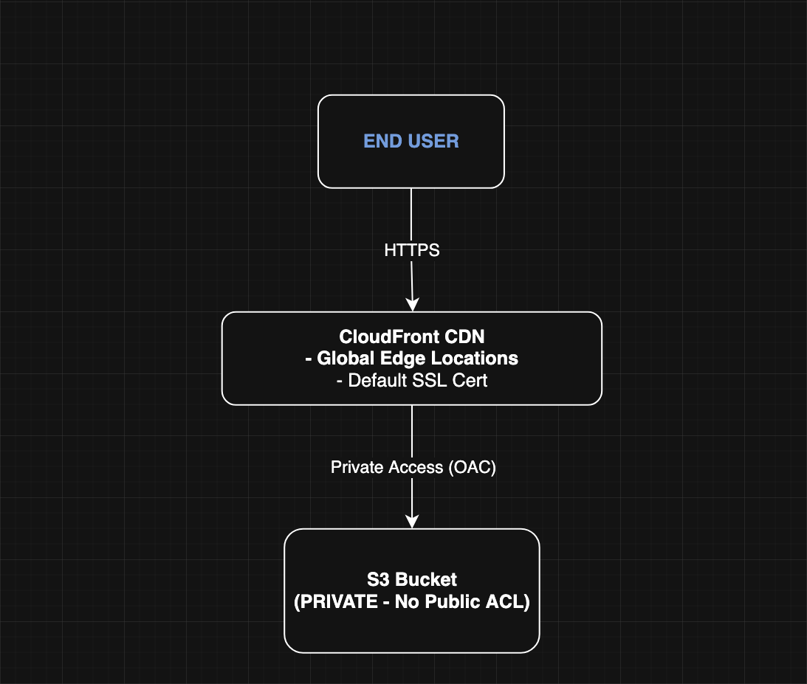

Secure Static Website on AWS (S3 + CloudFront + OAC)

This project demonstrates how to host a fully secure, globally cached static website using **Amazon S3** and **Amazon CloudFront** with **Origin Access Control (OAC)** — all without needing a custom domain.

This is a production-grade, zero-coding AWS architecture built with industry best practices.

---

Project Overview

- Website Content Stored in a Private S3 Bucket  
- Served Securely via CloudFront CDN  
- CloudFront’s Default HTTPS Certificate Used  
- S3 Bucket Locked Down Using OAC  
- Direct S3 Access Fully Blocked  
- Website Accessible via CloudFront HTTPS URL

---

Architecture Diagram

Below is the high-level architecture representing the request flow:

---

AWS Services Used

- **Amazon S3** — private static storage  
- **Amazon CloudFront** — global CDN & HTTPS  
- **Origin Access Control (OAC)** — secure S3 access  
- **IAM** — bucket policies  
- *(No custom domain, Route 53, or ACM required)*

---

---

##  Deployment Steps

The detailed deployment instructions are in:

   
(Contains Phase 1 + Phase 2 with screenshots and full explanations)

---

##  Security Highlights

- S3 bucket is **fully private** (not publicly accessible)
- CloudFront uses OAC to fetch content securely  
- Direct S3 URLs return **AccessDenied**  
- HTTPS enforced end-to-end automatically

---

##  Validation

To verify the deployment:

- Access the CloudFront URL:  
  `https://d********.cloudfront.net`  
- Confirm the **HTTPS lock icon**  
- Attempt to access S3 directly → should return **AccessDenied**

---

##  Cleanup

Cleanup instructions are available in:

👉 `docs/cleanup.md`

---

##  Lessons Learned

- Modern static hosting best practices on AWS  
- CloudFront OAC vs. old S3 “static website hosting”  
- Private S3 design patterns  
- CDN caching & invalidation behavior  
- End-to-end secure delivery with minimal services

---

##  Contact

Your Name  
- LinkedIn: *your link*  
- Email: *your email*

